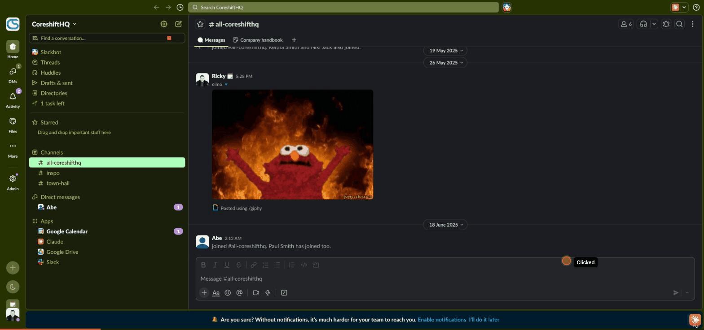
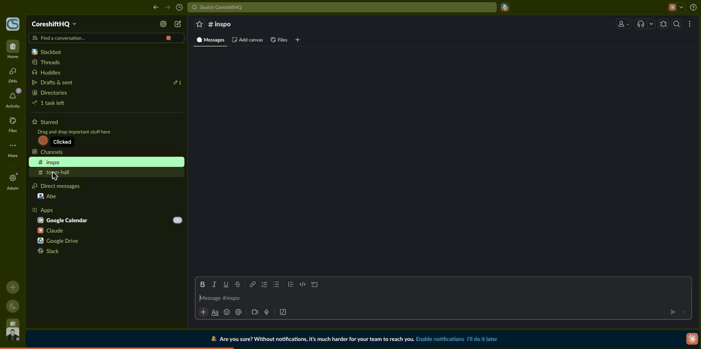
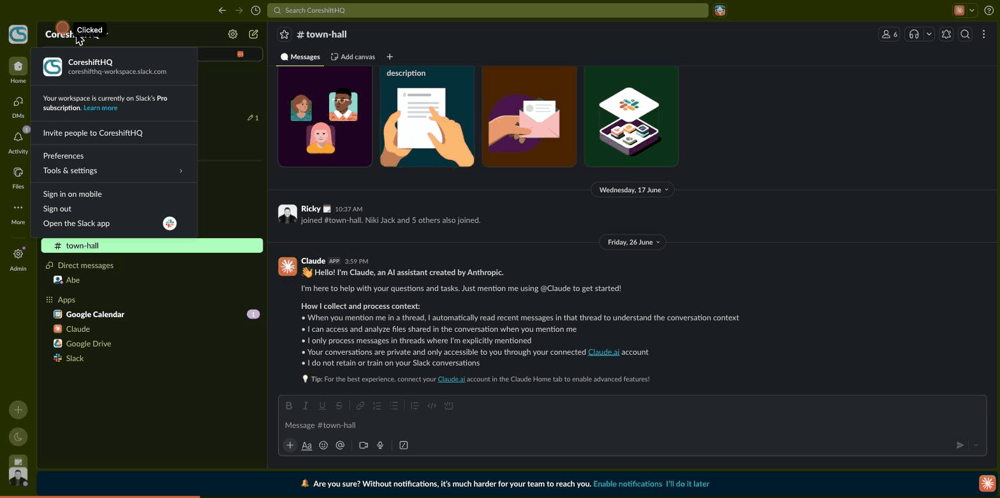
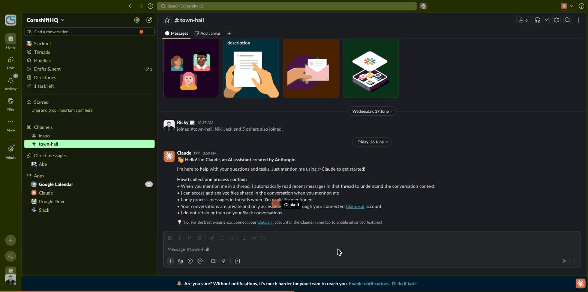

# We're moving to Slack 👋

Slack is now our main home for day-to-day communication at Coreshift. It's faster than email, easier to keep conversations organised, and a lot more fun to use.

If you've never used Slack before, don't worry — this page walks through the handful of habits that keep it tidy, with a short clip of each so you know exactly what to look for.

---

## Use threads

Reply *in a thread* to keep channels tidy and conversations easy to follow. Hover over any message, click the **speech-bubble (Reply in thread)** icon, and your reply opens in a side panel attached to that message — instead of cluttering the main channel.

*Hover a message → click the speech-bubble icon → type your reply in the thread panel.*

---

## Pick the right channel

Post where it belongs so the right people see it — and everyone else isn't buried in noise. Switch channels from the sidebar on the left (or hit the search bar up top to jump to any conversation).

*Click a channel in the left sidebar to move between conversations.*

A quick guide to ours:

- **#all-coreshifthq** — company-wide announcements and anything everyone should see.
- **#town-hall** — broader discussion and team updates.
- **#inspo** — ideas, references, and things worth sharing.

Not sure where something goes? Drop it in **#all-coreshifthq** and we'll point you to the right home.

---

## Mind notifications

Set your hours and use mentions sparingly so we respect each other's focus time. Open **Preferences → Notifications** (and **Availability** for working hours) to choose when and how Slack pings you.

*Workspace name (top-left) → Preferences → Notifications to control how you're pinged.*

Type **@** in any message to mention someone. Two of these are loud — use them with care:

- **@here** notifies everyone *currently online* in the channel.
- **@channel** notifies *every member*, online or not.

*Typing @ brings up the mention menu — @here and @channel reach lots of people, so save them for things that truly need everyone.*

---

## Keep email for the formal stuff

Contracts, official records, and anything that needs a paper trail still go through email. Slack is for the fast-moving day-to-day.

---

## Quick > polished

Slack is for moving fast. Don't overthink it — just hit send.

---

> Take a few minutes to set up your profile and notification preferences, then jump in. Questions? Just ask in **#all-coreshifthq**.
